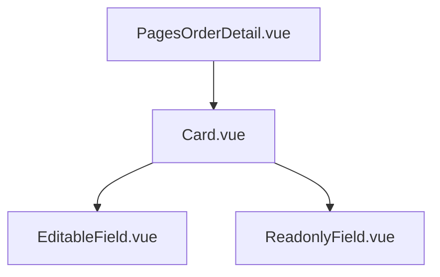
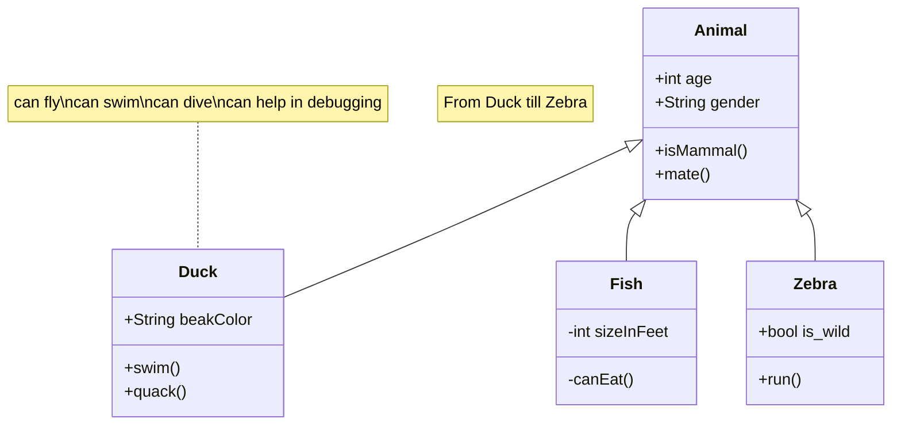

```mermaid
graph TD
    PagesOrderDetail.vue --> Card.vue
    Card.vue --> EditableField.vue
    Card.vue --> ReadonlyField.vue
```

+ client\src\modules\orders\form-3-nom\components
  + PagesOrderDetail.vue
  + Card.vue
    + EditableField.vue
    + ReadonlyField.vue

```mermaid
 classDiagram
  note "From Duck till Zebra"
  Animal <|-- Duck
  Animal <|-- Fish
  Animal <|-- Zebra
  note for Duck "can fly\ncan swim\ncan dive\ncan help in debugging"

  class Animal {
    +int age
    +String gender
    +isMammal()
    +mate()
  }

  class Duck {
    +String beakColor
    +swim()
    +quack()
  }

  class Fish {
    -int sizeInFeet
    -canEat()
  }

  class Zebra {
    +bool is_wild
    +run()
  }

```

