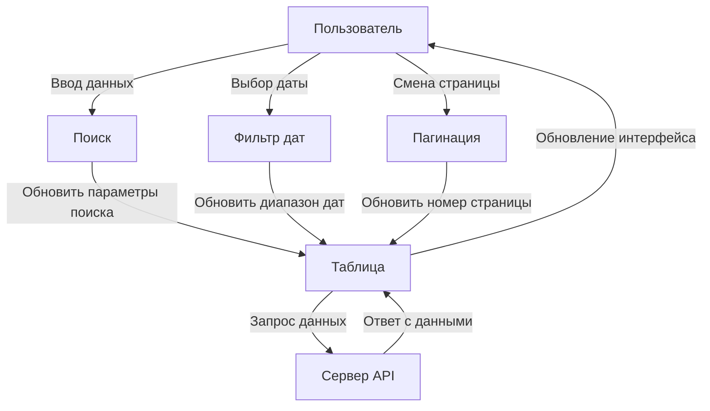
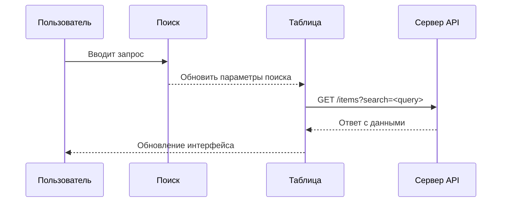
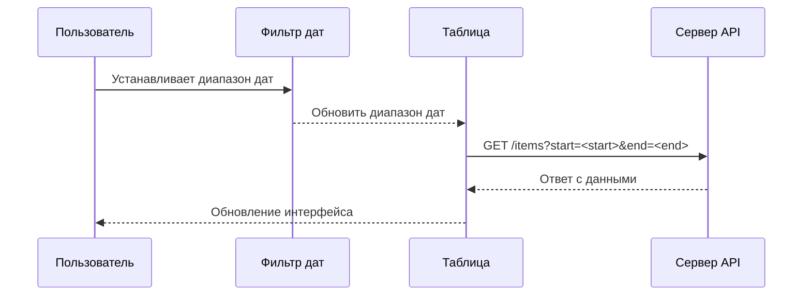
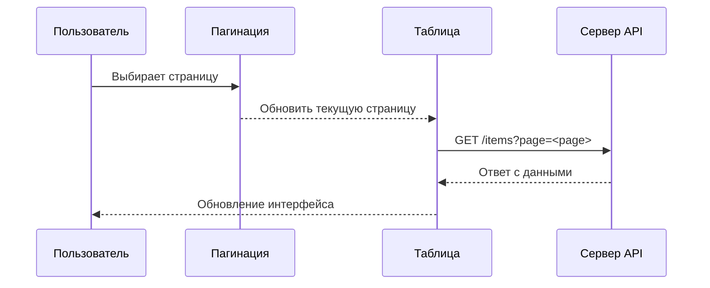

Спасибо за указание! Теперь документирую **без упоминания Pinia**.

### Полный код для MD:

# Взаимодействие компонентов

## Общая структура системы

---

## Последовательность взаимодействий

### Сценарий: Поиск данных

---

### Сценарий: Выбор диапазона дат

---

### Сценарий: Пагинация

---

## Подробности взаимодействия компонентов

1. **SearchBar (Поиск)**:
   - Отправляет обновление в таблицу.
   - Генерирует запрос с параметрами поиска.

2. **DateRangeFilters (Фильтр дат)**:
   - Изменяет диапазон дат.
   - Передаёт новые даты в таблицу.

3. **Pagination (Пагинация)**:
   - Управляет сменой страниц.
   - Передаёт обновлённую страницу в таблицу.

4. **ServerSideTable (Таблица)**:
   - Собирает параметры (поиск, даты, пагинация).
   - Отправляет запрос на сервер API.
   - Отображает обновлённые данные.

5. **API (Сервер)**:
   - Обрабатывает запросы от таблицы.
   - Возвращает данные.

---

Если потребуется ещё что-то скорректировать или расширить, дайте знать!